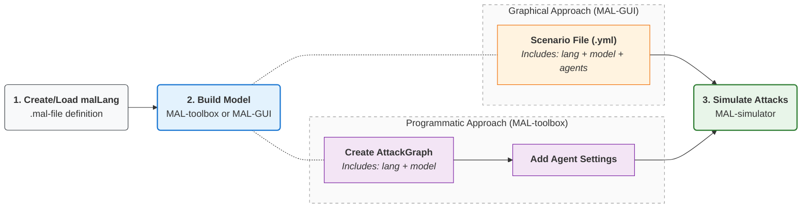

# Welcome to the home of the Meta Attack Language (MAL)

## **What is MAL?**
The **Meta Attack Language (MAL)** is a language used to create domain-specific threat modeling languages - a **malLang**.

We can think of it as a bridge between **systems modeling** (like UML) and **attack graphs**. It formalizes the process of generating potential attack graphs based on how a system is designed.
### **Core components of a malLang**
To build a language in MAL, you define four primary elements:
- **Assets:** The categories of things in your system (e.g., Computers, Applications, Networks, Data, Credentials).
- **Relationships:** How those assets are related (e.g., a Computer _runs_ Applications; a Computer _is connected to_ a Network).
- **Attack Steps:** The specific actions that can be taken against an Asset (e.g., _connect_, _authenticate_, _guess credentials_, or _compromise_ a Computer).
- **Causal Links:** How one successful attack may enable the next one. 

**Example**: An attacker succeeds with the `connect` action to a `Computer` asset. They can now attempt to `authenticate` (if they have succeeded to `compromise` the right `Credentials`) or `guessCredentials`. Success in either leads to a `compromise` of that `Computer` asset. The compromised `Computer` asset then allows the attacker to `connect` to any other device on the `Network` that the `Computer` _is connected to_.

### **The outcome**
By looking at your specific **system architecture** (how your assets are configured), MAL determines every possible attack vector and expresses them in an **attack graph**.

## Why MAL?
**MAL** allows cybersecurity expertise to be encoded and reused across diverse system environments. By capturing how systems are attacked and defended, MAL empowers designers and maintainers to analyze their specific infrastructures.

MAL enables the creation of a **cybersecurity digital twin**, facilitating several high-level functions:
- **Red & blue teaming:** Perform large-scale red team simulations and evaluate the effectiveness of blue team interventions.
- **Threat modeling:** Identify optimal security designs and guide operational protective actions based on observed attack chains.
- **Simulation-based training:** Utilize MAL asset and attack graphs as an infrastructure to train attacker and defender agents, for instance by using methods like machine learning.

## The MAL workflow
The usual workflow one would do with MAL is the following:
1. You either use a pre-existing **malLang** or write your own.
2. Load your malLang and create a **model**, either programmatically using Python modules via [MAL toolbox](https://github.com/mal-lang/mal-toolbox) or manually with the [MAL-GUI](https://github.com/mal-lang/mal-gui).
3. **Simulate attacks** with the simulation tool ([MAL simulator](https://github.com/mal-lang/mal-simulator)).

## MAL resources
MAL has been developed by Software Systems Architecture and Security group [[1]](https://www.kth.se/cs/nse/research/software-systems-architecture-and-security) [[2]](https://github.com/KTH-SSAS) at KTH Royal Institute of Technology in Sweden and this GitHub organization gathers results of many of the various projects that the research group has been working on over the years. A few highlights of these are:

### MAL specification

- [MAL specification wiki](https://github.com/mal-lang/mal-specification/wiki) documents the MAL syntax and sematics and describes how languages are built.

### Key infrastructure

- The [MAL toolbox](https://github.com/mal-lang/mal-toolbox), which contains support for building asset instance models from a given MAL language and then generating the corresponding attack graph from the asset instance model.

- The [MAL simulator](https://github.com/mal-lang/mal-simulator), which is an infrastructure for using the MAL attack graphs as a game board where defender and attacker agents can “play” against each other. It can be used as a simulator for machine learning of the agents.

- The [MAL-GUI](https://github.com/mal-lang/mal-gui), which is a super simple drag-n-drop studio for creating instance models given some chosen MAL-language.

### Tutorials

- [MAL tutorials](https://github.com/mal-lang/mal-tutorials) to learn how the MAL tools work.

### Additional infrastructure

- The [mal-vs-code-extension](https://github.com/mal-lang/mal-vscode-extension) for MAL language support in VS Code.
- [mal-language-server](https://github.com/mal-lang/mal-ls)

### MAL languages

- [exampleLang](https://github.com/mal-lang/exampleLang), which is a language devised to demonstrate how MAL works and good to start with if you are new to MAL.

- [coreLang](https://github.com/mal-lang/coreLang), which is a language that has the ambition to cover the most common attack vectors found in common IT environments ([example scenarios](https://github.com/mal-lang/malsim-scenarios/tree/main/scenarios/coreLang)).

- [tyrLang](https://github.com/mal-lang/tyrLang), a simpler variant of coreLang built for an external project ([example scenarios](https://github.com/mal-lang/malsim-scenarios/tree/main/scenarios/tyrLang)).

### Academic papers
More academic papers related to various MAL projects have been produced than what can be mentioned here, but there exist two papers on MAL per se:
- Pontus Johnson, Robert Lagerström, and Mathias Ekstedt. 2018. A Meta Language for Threat Modeling and Attack Simulations. In Proceedings of the 13th International Conference on Availability, Reliability and Security (ARES '18). Association for Computing Machinery, New York, NY, USA, Article 38, 1–8. https://doi.org/10.1145/3230833.3232799
- Wojciech Wideł, Simon Hacks, Mathias Ekstedt, Pontus Johnson, Robert Lagerström, The meta attack language - a formal description, Computers & Security, Volume 130, 2023, 103284, ISSN 0167-4048, https://doi.org/10.1016/j.cose.2023.103284

### ..And more
Also check out our sister project, [DynaMAL](https://gitlab.com/kth-ssas/dynamal-group/dynamal-documentation), featuring logic to update the asset and attack graphs dynamically during simulations, based on attacker actions.
